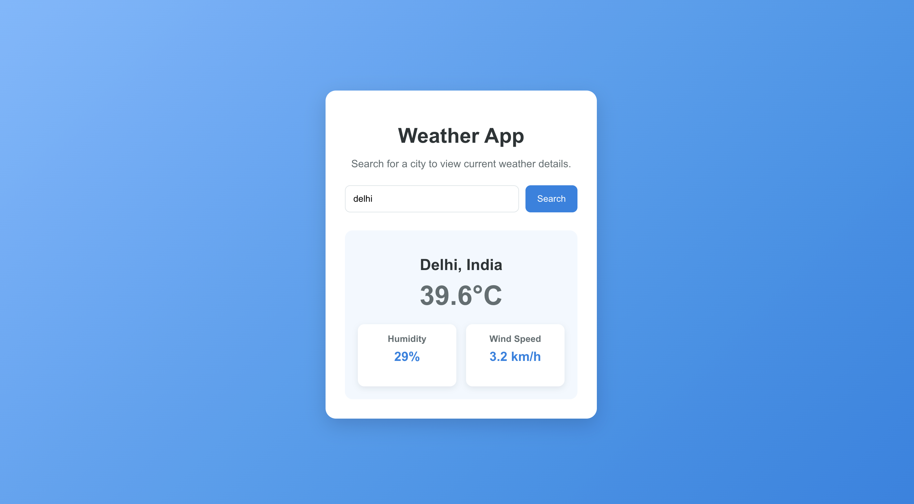

# Weather App

## Table of Contents

- [Overview](#overview)
- [Features](#features)
- [Technology Stack](#technology-stack)
- [Project Structure](#project-structure)
- [Prerequisites](#prerequisites)
- [Installation](#installation)
- [Configuration](#configuration)
- [Running the Application](#running-the-application)
- [Available Scripts](#available-scripts)
- [API Integration](#api-integration)
- [Screenshots](#screenshots)
- [Folder Structure](#folder-structure)
- [Future Enhancements](#future-enhancements)
- [License](#license)

## Overview

The Weather App is a React-based web application that provides real-time weather information for cities worldwide. The application retrieves weather data from a public weather API and displays current weather conditions through a simple, responsive, and user-friendly interface.

Users can search for a city to view information such as temperature, weather conditions, humidity, wind speed, atmospheric pressure, and the "feels like" temperature. The application communicates with the weather service using REST APIs and presents the retrieved data in an organized format.

The project demonstrates frontend development using React, API integration, asynchronous data fetching, state management with React Hooks, and responsive web design.

## Features

- Search weather information by city name
- Display current temperature
- Show weather conditions with icons
- Display "feels like" temperature
- View humidity levels
- Display wind speed
- Show atmospheric pressure
- Display minimum and maximum temperatures
- Responsive user interface for desktop and mobile devices
- Real-time weather updates using REST APIs
- Loading indicator during API requests
- Error handling for invalid city names and network failures

## Technology Stack

| Technology | Purpose |
|------------|---------|
| React | Frontend library |
| JavaScript (ES6+) | Application logic |
| HTML5 | Page structure |
| CSS3 | User interface styling |
| REST API | Weather data retrieval |
| Fetch API / Axios | HTTP requests |
| OpenWeather API | Weather information source |
| Node.js | Development environment |
| npm | Package management |

## Project Structure

```text
weather-app/
│
├── public/
│
├── screenshots/
│   ├── weather-app-screenshot.png
│
├── src/
│   ├── App.js
│   ├── index.js
│   ├── App.css
│   └── index.css
│
├── .gitignore
├── package.json
├── package-lock.json
├── README.md
├── USER_GUIDE.md
├── TECHNICAL_OVERVIEW.md
├── INSTALLATION_GUIDE.md
└── TROUBLESHOOTING.md
```

## Prerequisites

Before installing and running the Weather App, ensure the following software is installed on your system:

- Node.js (version 18 or later)
- npm (Node Package Manager)
- A modern web browser (Chrome, Edge, Firefox, or Safari)
- An active internet connection
- A valid OpenWeather API key

## Installation

Follow these steps to install the Weather App on your local system.

### Clone the Repository

```bash
git clone https://github.com/yourusername/weather-app.git
```

### Navigate to the Project Directory

```bash
cd weather-app
```

### Install Project Dependencies

```bash
npm install
```

## Configuration

The Weather App requires an API key to retrieve weather information from the OpenWeather API.

### Create an Environment File

Create a `.env` file in the project root directory.

```env
REACT_APP_WEATHER_API_KEY=your_api_key
```

### Environment Variables

| Variable | Description |
|----------|-------------|
| REACT_APP_WEATHER_API_KEY | API key used to authenticate requests to the OpenWeather API. |

> **Note:** Never commit your `.env` file or API keys to a public repository.

## Running the Application

After completing the installation and configuration steps, start the development server.

### Start the Development Server

```bash
npm start
```

The application will be available at:

```text
http://localhost:3000
```

Open the URL in your web browser to begin using the Weather App.

## Available Scripts

The following npm scripts are available for development and production builds.

| Command | Description |
|----------|-------------|
| `npm start` | Starts the development server. |
| `npm test` | Runs the test suite in interactive watch mode. |
| `npm run build` | Creates an optimized production build. |
| `npm run eject` | Removes the default React configuration (cannot be undone). |
| `npm install` | Installs all project dependencies. |

## API Integration

The Weather App retrieves real-time weather information from the OpenWeather API.

### Base URL

```text
https://api.openweathermap.org/data/2.5/weather
```

### Authentication

All requests to the OpenWeather API require an API key.

The API key must be included as the `appid` query parameter in each request.

### Request Parameters

| Parameter | Description |
|-----------|-------------|
| q | City name |
| appid | API key |
| units | Temperature unit (metric or imperial) |

### Example Request

```http
GET /data/2.5/weather?q=Delhi&units=metric&appid=YOUR_API_KEY
```

### Response Data

The application displays the following weather information:

- City name
- Current temperature
- Weather condition
- "Feels like" temperature
- Humidity
- Wind speed
- Atmospheric pressure
- Minimum temperature
- Maximum temperature

## Screenshots

The following screenshots demonstrate the Weather App user interface.

### Home Screen



## Folder Structure

The project follows a modular folder structure to improve code organization and maintainability.

| Folder/File | Description |
|-------------|-------------|
| `public/` | Static assets served directly by the application. |
| `src/` | Contains the application source code. |
| `App.js` | Root React component. |
| `index.js` | Application entry point. |
| `App.css` | Component-level application styles. |
| `index.css` | Global application styles. |

## Future Enhancements

The following enhancements may be considered for future releases:

- Five-day weather forecast
- Hourly weather forecast
- Automatic location detection using geolocation
- Weather maps
- Air quality index (AQI)
- Sunrise and sunset information
- Favorite cities
- Dark mode
- Multi-language support
- Unit conversion between Celsius and Fahrenheit
- Progressive Web App (PWA) support
- Offline caching for previously searched locations
- Search history
- Recent searches

## License

This project is provided for educational and portfolio purposes.

You are free to use, modify, and reference the project for learning purposes. If you plan to use this project in a production environment, ensure that you comply with the licensing terms of any third-party libraries and APIs used, including the OpenWeather API.

For more information, refer to the respective license documentation of each dependency.
